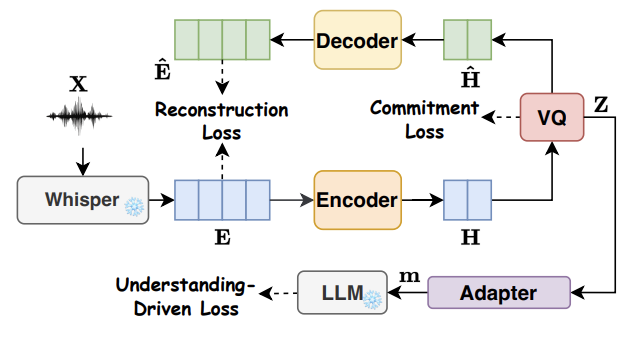

<p align="center">

  <h2 align="center"> DualSpeechLM: Towards Unified Speech Understanding and Generation via Dual Speech Token Modeling with Large Language Models </h2>
  <p align="center">
        <a href="https://arxiv.org/abs/2508.08961">
        </a> &nbsp; &nbsp;  &nbsp; 
        <a href='https://lavendery.github.io/Unified-Understanding-and-Generalization-Demo/'>
        </a> &nbsp;&nbsp; &nbsp; 
        <a href="https://github.com/lavendery/UUG">
          
        </a>&nbsp;&nbsp; &nbsp; 
  </p>
    </p>

This repo contains our official implementation of <strong> DualSpeechLM </strong>. For the generated audio, Please refer to [[Demo]](https://lavendery.github.io/Unified-Understanding-and-Generalization-Demo/). You can find our paper from [[Paper]](https://arxiv.org/abs/2508.08961).

## Abstract
Extending pre-trained Large Language Models (LLMs)'s speech understanding or generation abilities by introducing various effective speech tokens has attracted great attention in the speech community. However, building a unified speech understanding and generation model still faces the following challenges: (1) Due to the huge modality gap between speech tokens and text tokens, extending text LLMs to unified speech LLMs relies on large-scale paired data for fine-tuning, and (2) Generation and understanding tasks prefer information at different levels, e.g., generation benefits from detailed acoustic features, while understanding favors high-level semantics. This divergence leads to difficult performance optimization in one unified model. To solve these challenges, in this paper, we present two key insights in speech tokenization and speech language modeling. Specifically, we first propose an Understanding-driven Speech Tokenizer (USTokenizer), which extracts high-level semantic information essential for accomplishing understanding tasks using text LLMs. In this way, USToken enjoys better modality commonality with text, which reduces the difficulty of modality alignment in adapting text LLMs to speech LLMs. Secondly, we present DualSpeechLM, a dual-token modeling framework that concurrently models USToken as input and acoustic token as output within a unified, end-to-end framework, seamlessly integrating speech understanding and generation capabilities. Furthermore, we propose a novel semantic supervision loss and a Chain-of-Condition (CoC) strategy to stabilize model training and enhance speech generation performance. Experimental results demonstrate that our proposed approach effectively fosters a complementary relationship between understanding and generation tasks, highlighting the promising strategy of mutually enhancing both tasks in one unified model.
<p align="center">
<!--  -->

</p>

## 📣 News & TODOs
- [x] **[2025.08.12]** Release paper and project page.
- [x] **[2025.09.03]** Release USTokenizer code.
- [ ] Release DualSpeechLM code (coming soon).
- [ ] Release pretrained weights (coming soon).


## USTokenizer
### 1.Installation Environment
```
git clone https://github.com/lavendery/UUG.git
conda create -n USTokenizer python=3.10
conda activate USTokenizer

cd USTokenizer
pip install -r requirements.txt
```
### 2. Training the Tokenizer
(1) Configure your settings in configs/config.yaml.

(2) Prepare the required public checkpoints: 'Llama' and 'Whisper'. 

(3) Create your training/dev/test dataset file meta.json with the following format:
```
{
    "annotation": [
        {
            "path": "audio_path/4693/17508/4693-17508-0000.flac",
            "text": "chapter eleven the eagle screams despite the glories of the amalfi road",
            "task": "asr"
        },
        ...
    ]
}
```
(4) Training Command:
```
cd USTokenizer
bash run.sh
```

### Inference/Generating Discrete Code (USToken)
To generate discrete codes using the trained tokenizer:
```
bash infer.sh
```

## Citation
```bibtex
@misc{wang2025dualspeechlm,
      title={DualSpeechLM: Towards Unified Speech Understanding and Generation via Dual Speech Token Modeling with Large Language Models}, 
      author={Yuanyuan Wang and Dongchao Yang and Yiwen Shao and Hangting Chen and Jiankun Zhao and Zhiyong Wu and Helen Meng and Xixin Wu},
      year={2025},
      eprint={2508.08961},
      archivePrefix={arXiv},
      primaryClass={cs.SD},
      url={https://arxiv.org/abs/2508.08961}, 
}
```

## Acknowledgments
This repository is developed based on the following repos, and we thank them for open-sourcing their great code!
* [SALMONN](https://github.com/bytedance/SALMONN/tree/salmonn)
* [RepCodec](https://github.com/mct10/RepCodec)
* [AudioDec](https://github.com/facebookresearch/AudioDec/tree/main)
